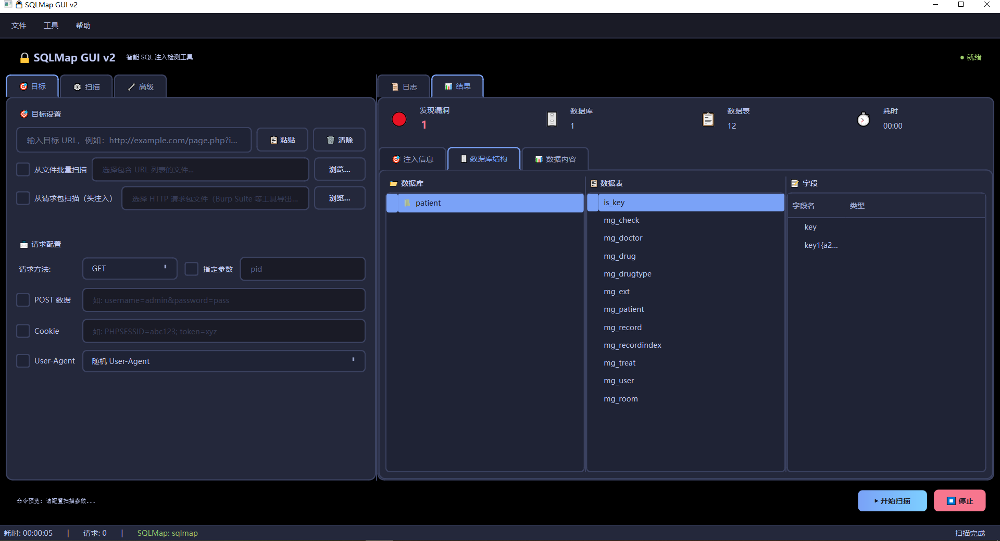
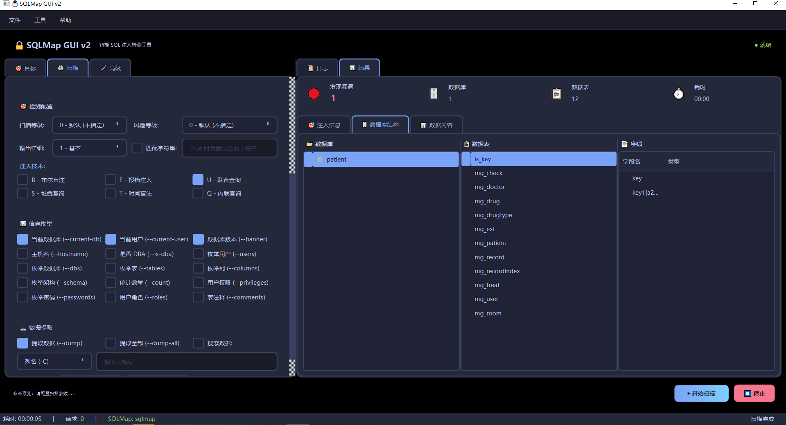
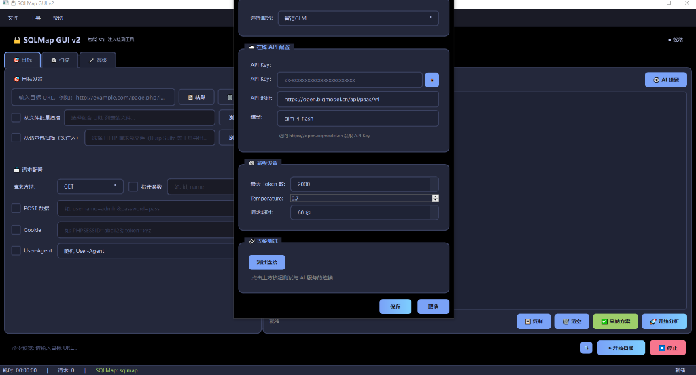

# SQLMap GUI v2

🔒 **智能 SQL 注入检测图形化工具**



[](https://python.org)
[](https://pypi.org/project/PyQt6/)
[](LICENSE)

SQLMap GUI v2 是一个基于 PyQt6 开发的现代化 SQLMap 图形界面工具。它旨在简化 SQL 注入测试流程，提供直观的操作体验、强大的配置管理和丰富的结果展示功能，让安全测试变得更加轻松高效。

---

## ✨ 核心亮点

### 🎨 现代化交互界面
告别枯燥的命令行！我们提供了精心设计的现代化 UI，支持 **5 种精美主题**（深色/浅色/深蓝/紫色/绿色），兼顾美观与实用，让长时间测试不再疲劳。

### 🛡️ 强大的 Tamper 脚本支持
内置 **70+ 种绕过脚本**，按功能科学分类（WAF 绕过、代码混淆、特殊字符处理等）。通过全新的可视化对话框，您可以轻松勾选组合多个脚本，无惧各种防护策略。


### ⚡ 智能扫描模式
提供多种预设扫描模式，一键适配不同场景：
- **🚀 快速检测**: 仅使用最有效的技术快速判断。
- **🔍 标准扫描**: 平衡速度与深度，适合日常使用。
- **🔬 深度扫描**: 全面检测，不放过任何蛛丝马迹。
- **⚔️ 激进模式**: 启用所有技术和绕过策略（慎用）。



### 📊 实时结果与数据提取
- **实时日志**: 像终端一样实时显示 SQLMap 运行状态。
- **可视化数据**: 以树状图展示数据库、表、列结构。
- **数据导出**: 支持将提取的数据一键导出为 **CSV** 或 **JSON** 格式。
- **交互式操作**: 右键即可提取整个数据库或单表数据。

### 💾 贴心的配置管理
- **配置持久化**: 自动保存您的扫描偏好，下次打开即用。
- **扫描历史**: 完整的历史记录功能，随时回溯查看 URL、Payload 和扫描结果。

### 🤖 AI 智能分析（新功能）
集成多种 AI 后端，智能分析扫描日志，提供专业优化建议：



**支持的 AI 服务：**
| 类型 | 服务 | 说明 |
|------|------|------|
| 本地 | Ollama | 支持 Qwen、LLaMA 等本地模型，数据不出本地 |
| 国际 | OpenAI / Claude | GPT-4o、Claude 3 等 |
| 国内 | DeepSeek | 性价比最高，推荐使用 |
| 国内 | 通义千问 | 阿里云 Qwen 系列 |
| 国内 | 智谱 GLM | 清华团队出品 |
| 国内 | 月之暗面 Kimi | 长文本支持好 |

**核心功能：**
- 🟢 **安全方案推荐**：保守稳定，只关注漏洞检测，不推荐危险功能
- 🔴 **激进方案推荐**：高效但有风险，需用户确认后使用
- ⚠️ **风险警告**：采纳危险参数时自动提示潜在风险
- 📋 **一键采纳**：推荐参数可一键应用到扫描配置
- 🔍 **Payload 提取**：自动从日志中提取成功的注入 Payload

---

## 📋 系统要求

- Windows 10/11
- Python 3.7+
- PyQt6 6.4+
- sqlmap (需单独下载)

## 🚀 快速开始

### 1. 安装依赖

```bash
pip install -r requirements.txt
```

### 2. 配置 SQLMap

将 SQLMap 项目解压到本程序的 `sqlmap` 目录下，结构如下：

```
sqlmap_gui_v2/
├── main.py
├── ui/
└── sqlmap/            # 在此放置 SQLMap
    ├── sqlmap.py
    └── ...
```

或者在程序设置中指定 `sqlmap.py` 的绝对路径。

### 3. 启动程序

**方式一：双击启动**
双击 `start.bat` 即可运行。

**方式二：命令行启动**
```bash
python main.py
```

## 📖 使用指南

1. **配置目标**: 输入 URL（如 `http://example.com/id=1`），可选择性配置 Cookie、User-Agent 等。
2. **选择模式**: 根据需求选择“快速”、“标准”或“深度”模式。
3. **高级配置**: 在高级面板中勾选 Tamper 脚本、设置代理或选择特定的注入技术。
4. **开始扫描**: 点击开始，观察实时日志。
5. **查看结果**: 发现注入后，切换到“结果”标签页，浏览数据库结构，右键提取即感兴趣的数据。

## ⚠️ 免责声明

本工具仅供授权安全测试与教育目的使用。在未获得目标系统所有者明确许可的情况下，请勿对任何系统进行扫描或攻击。使用者需自行承担因违规使用本工具而产生的一切法律责任。

---

**开发者：辰辰** | **版本：2.0.0**

